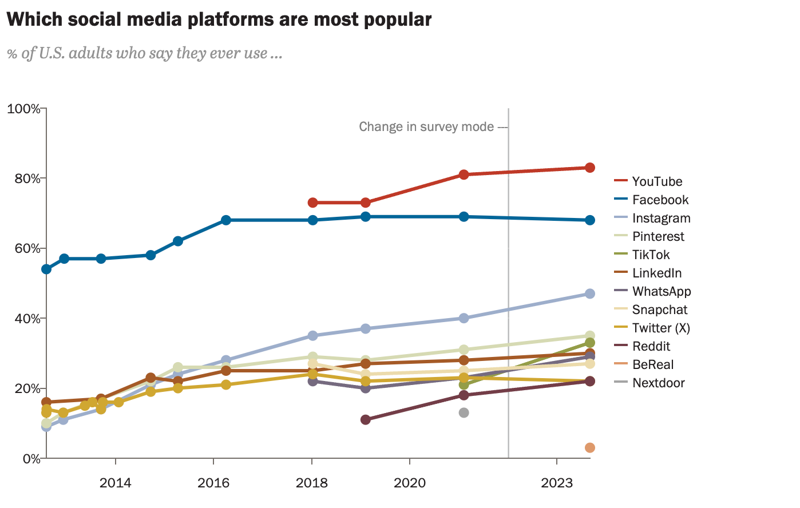
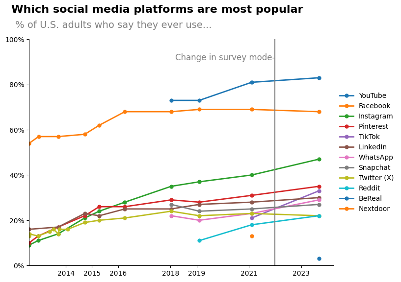
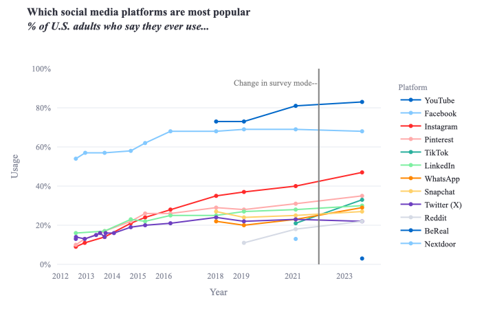

# outline

## 任务说明

data world 中提供的数据可完成 图3、4

网页中下载的数据可完成 图1、2、5

**note： 两个数据文件都在`data`文件夹中**

## 图1

**链接**：`https://www.pewresearch.org/internet/fact-sheet/social-media/?tabItem=3345cffa-94a6-4e74-9272-70dee1e0e213#who-uses-each-social-media-platform`

**数据源**: `data/which_social_media_platforms_are_most_popular_data_2024-01-31.csv`

**图片**：

### 目前完成效果
静态：

动态：

### 待调整：

- ~~x axis 日期显示为只存在于数据year column中的日起~~

- ~~legend 边框去除~~

- ~~辅助线的文字说明位置调整~~

- ~~标题位置调整~~

- ~~字体调整~~

- ~~颜色调整~~

- ~~数据点交互效果，点击对应数据点显示数据~~

### 提升：

- ~~选择legend中对应的平台实现该平台保留，其他平台全隐藏的交互效果~~

- ~~增加视频平台图标在legend后面？ [icon链接](https://www.flaticon.com/search?word=whatsapp)~~ 太麻烦了

### 交付：

- Video/slide
- Code (整合)

