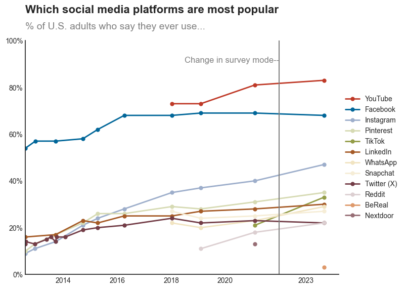

# outline

## 任务说明

data world 中提供的数据可完成 图3、4

网页中下载的数据可完成 图1、2、5

**note： 两个数据文件都在`data`文件夹中**

## 图1

**链接**：`https://www.pewresearch.org/internet/fact-sheet/social-media/?tabItem=3345cffa-94a6-4e74-9272-70dee1e0e213#who-uses-each-social-media-platform`

**数据源**: `data/which_social_media_platforms_are_most_popular_data_2024-01-31.csv`

**图片**：

### 目前完成效果

### 待调整：

- x axis 日期显示为只存在于数据year column中的日起
- legend 边框去除
- 辅助线的文字说明位置调整
- 标题位置调整

## 图二

**链接**：`https://www.pewresearch.org/internet/2024/01/31/americans-social-media-use/`

**数据源**: `data/Social_Media_Usage_pivoted.xlsx`

**图片**:

### 目前完成效果： 无

## 图三

链接：`https://www.pewresearch.org/internet/2024/01/31/americans-social-media-use/`

数据源: `data/Social_Media_Usage_pivoted.xlsx`

**图片:**

### 目前完成效果 无

## 图四

**链接：**`https://www.pewresearch.org/internet/2024/01/31/americans-social-media-use/`

**数据源:** `data/Social_Media_Usage_pivoted.xlsx`

**图片:**

### 目前完成效果 无

## 图五：

**链接**：`https://www.pewresearch.org/internet/fact-sheet/social-media/?tabItem=3345cffa-94a6-4e74-9272-70dee1e0e213#who-uses-each-social-media-platform`

**数据源**: `data/which_social_media_platforms_are_most_popular_data_2024-01-31.csv`

**图片**：**该图片为交互式表格**

